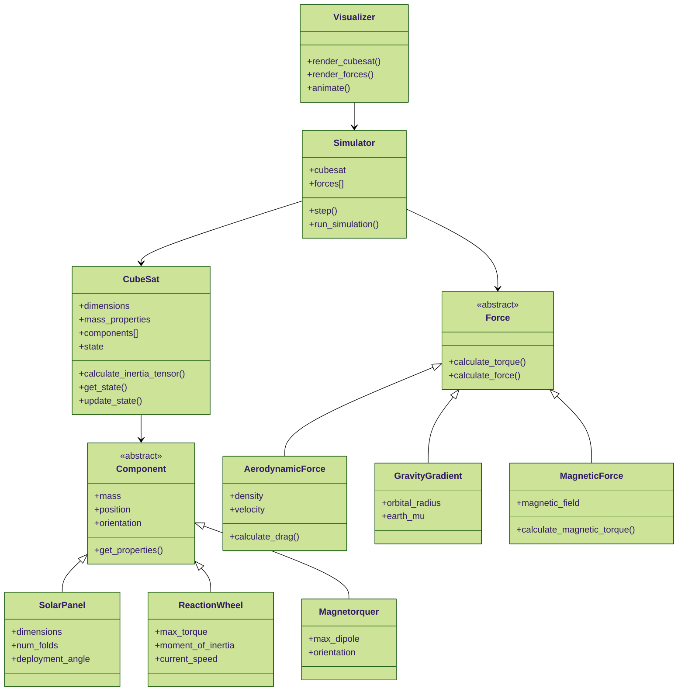

# CubeSat Attitude Simulator

A Python-based attitude dynamics simulator for CubeSats that models various environmental torques and control actuators. This simulator focuses on attitude dynamics and control, particularly for CubeSats in Low Earth Orbit (LEO).

## Features

- **Full 6-DOF Attitude Dynamics**: Accurate quaternion-based attitude propagation
- **Environmental Torques**:
  - Aerodynamic drag
  - Gravity gradient
  - Magnetic disturbances
- **Control Actuators**:
  - Magnetorquers
  - Reaction wheels
- **Component System**:
  - Modular component architecture
  - Mass properties calculation
  - Solar panel modeling
- **Built-in Control Algorithms**:
  - B-dot detumbling
  - (More to come!)
- **Visualization**:
  - 3D attitude visualization
  - Real-time plotting
  - Angular velocity tracking
  - Magnetic field visualization

## Installation

```bash
git clone https://github.com/yourusername/cubesat-attitude-sim.git
cd cubesat-attitude-sim
pip install -r requirements.txt
```

## Quick Start

```python
from cubesat_sim import CubeSat, Simulator
from cubesat_sim.components import Magnetorquer
from cubesat_sim.visualization import create_detumbling_animation

# Create a 3U CubeSat
cubesat = CubeSat(size_units=3)

# Add magnetorquers
mtq_x = Magnetorquer("MTQ_X", axis=[1,0,0], max_dipole=0.2)
mtq_y = Magnetorquer("MTQ_Y", axis=[0,1,0], max_dipole=0.2)
mtq_z = Magnetorquer("MTQ_Z", axis=[0,0,1], max_dipole=0.2)

cubesat.add_component(mtq_x)
cubesat.add_component(mtq_y)
cubesat.add_component(mtq_z)

# Create and configure simulator
sim = Simulator(cubesat)
sim.setup_tumbling_state(max_angular_velocity=0.2)

# Run detumbling scenario
results = sim.run(scenarios=['detumble'])

# Visualize results
animation = create_detumbling_animation(results, cubesat)
```

## Project Structure

```
cubesat_sim/
├── components/              # Spacecraft components
│   ├── component.py        # Base component class
│   ├── magnetorquer.py     # Magnetorquer implementation
│   ├── reaction_wheel.py   # Reaction wheel implementation
│   └── solar_panel.py      # Solar panel implementation
├── forces/                 # Environmental forces
│   ├── force.py           # Base force class
│   ├── aerodynamic.py     # Aerodynamic forces
│   ├── gravity_gradient.py # Gravity gradient torque
│   └── magnetic.py        # Magnetic field interactions
├── utils/                  # Utility functions
│   ├── constants.py       # Physical constants
│   ├── quaternion.py      # Quaternion operations
│   └── transformations.py # Coordinate transforms
├── visualization/          # Visualization tools
│   ├── renderer.py        # 3D rendering
│   ├── plots.py          # Data plotting
│   └── animate.py        # Animation generation
├── cubesat.py             # Main CubeSat class
├── simulator.py           # Simulation engine
└── state.py              # Attitude state management
```



## Core Components

### CubeSat Class
The main spacecraft class that manages components, calculates mass properties, and handles state propagation.

### Component System
Abstract base class for all spacecraft components with derived classes for specific hardware:
- Magnetorquers
- Reaction wheels
- Solar panels

### Force System
Modular system for environmental forces and torques:
- Aerodynamic drag
- Gravity gradient
- Magnetic field interactions

### Attitude State
Comprehensive attitude state management including:
- Quaternion representation
- Angular velocity
- State propagation
- Energy and momentum calculations

## Examples

### Running a Detumbling Simulation
```python
from cubesat_sim import CubeSat, Simulator
from cubesat_sim.components import Magnetorquer

# Create CubeSat
cubesat = CubeSat(size_units=3)

# Add magnetorquers
for axis in [[1,0,0], [0,1,0], [0,0,1]]:
    mtq = Magnetorquer(f"MTQ_{axis[0]}{axis[1]}{axis[2]}", 
                      axis=axis, max_dipole=0.2)
    cubesat.add_component(mtq)

# Run simulation
sim = Simulator(cubesat)
sim.setup_tumbling_state()
results = sim.run(scenarios=['detumble'])
```

### Visualizing Results
```python
from cubesat_sim.visualization import SimulationPlotter

# Create summary plots
plotter = SimulationPlotter()
plotter.create_detumbling_summary(results, save_path="detumbling_summary.png")
```

## Contributing

Contributions are welcome! Please feel free to submit a Pull Request. For major changes, please open an issue first to discuss what you would like to change.

## License

This project is licensed under the MIT License - see the LICENSE file for details.

## Acknowledgments

- Based on spacecraft dynamics equations from Wertz's "Spacecraft Attitude Determination and Control"
- Magnetic field models from the International Geomagnetic Reference Field (IGRF)
- Visualization inspired by NASA's General Mission Analysis Tool (GMAT)
- The one and only Claude 3.5 Sonnet (big up yourself buddy, you cooked)